# Gear Samples

These samples are available in the Tizen SDK for Wearable in the 

<pre>
~/tizen-wearable-sdk/platforms/tizenw-1.0/samples/web/Sample/Tizen/Web App
</pre>

To use the samples, import the contents of the 'project' folder within each
sample into your Eclipse workspace.

## Altimeter

A tutorial sample application demonstrating Altimeter.

## Calendar

A tutorial sample application demonstrating Calendar.

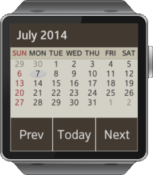

## ClockWidget

A tutorial sample application demonstrating ClockWidget.

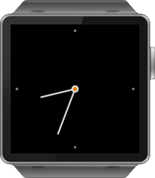

## Pedometer

A tutorial sample application demonstrating Pedometer.

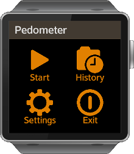

## VoiceRecorder

A tutorial sample application demonstrating VoiceRecorder.

## AnalogWatch  

A tutorial sample application demonstrating AnalogWatch.

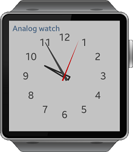

## Camera    

A tutorial sample application demonstrating Camera.

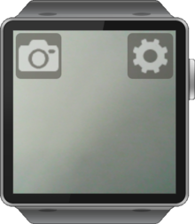

## MediaControl  

A tutorial sample application demonstrating MediaControl.

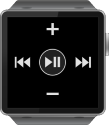

## StopWatch  

A tutorial sample application demonstrating StopWatch.

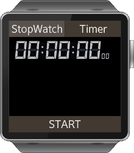

## WearableWidgets

A tutorial sample application demonstrating WearableWidgets.

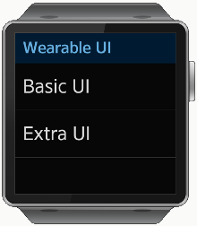

# Gear Templates

These samples are part of the Tizen SDK for Wearable and are used as the start
of new projects for Gear devices. They are minimal samples with a working
structure, but little in the way of example code.

## Basic/TizenW_basic

Tizen basic application.

## Basic/TizenW_jquery_template

Basic application based on JQuery.

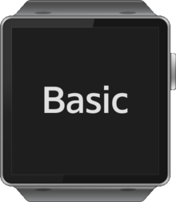

## IME_Application/ime_app

This is the web-based IME application template, which lets you to create your own IME only by writing HTML, CSS and Javascript code.

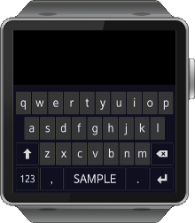

## Wearable_UI/Basic

Wearable UI basic application.

## Wearable_UI/List

Wearable UI list application.

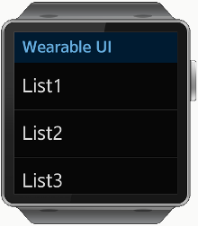

