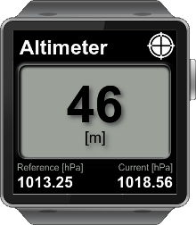

# Gear Samples

These samples are available in the Tizen SDK for Wearable in the 

<pre>
~/tizen-wearable-sdk/platforms/tizenw-1.0/samples/web/Sample/Tizen/Web App
</pre>

To use the samples, import the contents of the 'project' folder within each
sample into your Eclipse workspace.

## Altimeter

A tutorial sample application demonstrating Altimeter.

## Calendar
## ClockWidget
## Pedometer
## VoiceRecorder
## AnalogWatch  
## Camera    
## MediaControl  
## StopWatch  
## WearableWidgets

# Gear Templates

These samples are part of the Tizen SDK for Wearable and are used as the start
of new projects for Gear devices. They are minimal samples with a working
structure, but little in the way of example code.
